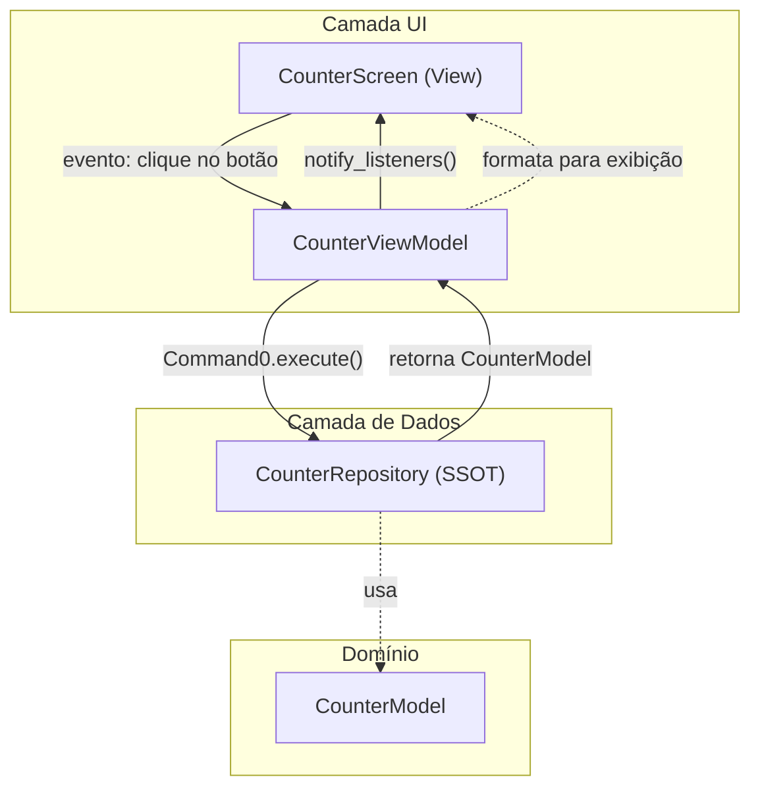

# Curso Academia IA — App Flet

Aplicação de exemplo em [Flet](https://flet.dev/) com arquitetura inspirada nas [diretrizes oficiais do Flutter](https://docs.flutter.dev/app-architecture/guide) e no [estudo de caso Compass](https://docs.flutter.dev/app-architecture/case-study).

O projeto implementa o padrão **MVVM** (Model-View-ViewModel), com separação clara entre camada de UI, camada de dados e modelos de domínio.

---

## Requisitos

- Python 3.10+
- Ambiente virtual ativo (`.venv`)

## Como executar

```bash
cd Curso_Academia_IA
source .venv/bin/activate
python main.py
```

---

## Visão geral da arquitetura

A arquitetura segue três princípios centrais do Flutter, adaptados para Python/Flet:

| Princípio | Descrição |
|-----------|-----------|
| **Separação de responsabilidades** | UI, lógica de apresentação e dados ficam em camadas distintas |
| **Fonte única de verdade (SSOT)** | Cada tipo de dado tem um único dono — o *Repository* |
| **Fluxo unidirecional de dados (UDF)** | Eventos sobem da View para o ViewModel; dados descem do Repository para a UI |



---

## Estrutura de pastas

Organização híbrida, como no estudo de caso Flutter: a camada **UI** é agrupada por *feature*; a camada **data** é agrupada por *tipo*.

```
Curso_Academia_IA/
├── main.py                          # Ponto de entrada e injeção de dependências
└── lib/
    ├── ui/                          # Camada de apresentação
    │   ├── core/                    # Componentes compartilhados entre features
    │   │   ├── commands/
    │   │   │   └── command.py       # Command0 / Command1
    │   │   ├── listenable/
    │   │   │   └── change_notifier.py
    │   │   └── ui/
    │   │       └── primary_filled_button.py
    │   └── counter/                 # Feature: contador
    │       ├── view_models/
    │       │   └── counter_view_model.py
    │       └── widgets/
    │           └── counter_screen.py
    ├── domain/                      # Modelos de domínio da aplicação
    │   └── models/
    │       └── counter_model.py
    └── data/                        # Camada de dados
        ├── repositories/
        │   └── counter_repository.py
        ├── services/                # Reservado para APIs e plugins (futuro)
        └── model/                   # Reservado para modelos de API (futuro)
```

### Convenções de nomenclatura

| Tipo | Padrão | Exemplo |
|------|--------|---------|
| View (tela) | `<feature>_screen.py` | `counter_screen.py` |
| ViewModel | `<feature>_view_model.py` | `counter_view_model.py` |
| Repository | `<feature>_repository.py` | `counter_repository.py` |
| Modelo de domínio | `<feature>_model.py` | `counter_model.py` |

Cada nova feature em `lib/ui/<feature_name>/` deve ter, no mínimo, uma pasta `view_models/` e uma pasta `widgets/`.

---

## Camadas e responsabilidades

### 1. UI Layer (`lib/ui/`)

Equivalente à camada de apresentação do MVVM. Contém **Views** e **ViewModels**.

#### View — `CounterScreen`

- Renderiza widgets Flet (`ft.Text`, `ft.Column`, `ft.FloatingActionButton`)
- **Não** contém regra de negócio
- Encaminha eventos do usuário ao ViewModel (ex.: `increment.execute()`)
- Escuta mudanças via `add_listener` e atualiza os controles

#### ViewModel — `CounterViewModel`

- Obtém dados do Repository
- Transforma dados brutos em estado pronto para a UI (`count`, `count_label`)
- Expõe **comandos** (`Command0`) para a View
- Notifica a UI quando o estado muda (`notify_listeners()`)

#### Core compartilhado (`lib/ui/core/`)

| Módulo | Papel |
|--------|-------|
| `change_notifier.py` | Adaptação do `ChangeNotifier` do Flutter |
| `command.py` | Padrão Command (`Command0`, `Command1`) para ações da UI |
| `primary_filled_button.py` | Widget reutilizável com estilo padrão |

### 2. Domain Layer (`lib/domain/`)

Contém os **modelos de domínio** — estruturas imutáveis que representam os dados da aplicação, independentes de UI e de fonte de dados.

```python
@dataclass(frozen=True)
class CounterModel:
    value: int
```

### 3. Data Layer (`lib/data/`)

Gerencia o acesso e a mutação dos dados da aplicação.

#### Repository — `CounterRepository`

- **Fonte única de verdade (SSOT)** para o contador
- Único componente autorizado a alterar o valor do contador
- Retorna instâncias de `CounterModel` para o ViewModel

#### Services e model (reservados)

As pastas `services/` e `model/` existem na estrutura, mas ainda não possuem implementação. Serão usadas quando houver integração com APIs, arquivos ou plugins de plataforma.

---

## Fluxo de dados — exemplo Counter

Quando o usuário pressiona o botão flutuante `+`:

```
1. [View]       CounterScreen repassa o clique → view_model.increment.execute()
2. [ViewModel]  Command0 chama _increment() → repository.increment()
3. [Repository] Incrementa _count e retorna CounterModel atualizado
4. [ViewModel]  notify_listeners() informa que o estado mudou
5. [View]       _on_view_model_changed() atualiza o ft.Text na tela
```

A UI **nunca** altera o contador diretamente. Toda mutação passa pelo Repository.

---

## Padrões utilizados

### MVVM

Cada feature possui um par **View + ViewModel**:

- **Model** → Repository + Domain models
- **View** → `CounterScreen`
- **ViewModel** → `CounterViewModel`

### ChangeNotifier

Equivalente ao `ChangeNotifier` do Flutter. Permite que a View se inscreva em mudanças de estado sem acoplamento direto:

```python
view_model.add_listener(self._on_view_model_changed)
# ...
view_model.notify_listeners()  # dispara a atualização da UI
```

No Flet, o listener chama `.update()` nos controles afetados — similar ao `ListenableBuilder` do Flutter.

### Command Pattern

Comandos encapsulam ações que a View pode executar sem conhecer a implementação:

```python
self.increment = Command0(self._increment)
# Na View:
on_click=lambda _: self._view_model.increment.execute()
```

`Command0` suporta ações síncronas e assíncronas, expõe `running` e `error` para estados de carregamento futuros.

### Injeção de dependências manual

O `main.py` monta o grafo de dependências explicitamente, sem bibliotecas externas:

```python
counter_repository = CounterRepository()
counter_view_model = CounterViewModel(counter_repository)
counter_screen = CounterScreen(counter_view_model)
```

---

## Como adicionar uma nova feature

1. Crie `lib/ui/<nome_da_feature>/view_models/` e `widgets/`
2. Defina o modelo em `lib/domain/models/<nome>_model.py`
3. Implemente o Repository em `lib/data/repositories/<nome>_repository.py`
4. Crie o ViewModel estendendo `ChangeNotifier`
5. Crie a View consumindo apenas o ViewModel
6. Registre as dependências no `main.py`

---

## Escopo atual e limitações intencionais

Por decisão de arquitetura inicial, **não estão implementados**:

- Acesso a backend / APIs (`services/`)
- Persistência de dados (storage local ou remoto)
- Autenticação
- Internacionalização (i18n)
- Testes automatizados
- Logging estruturado

Essas camadas serão adicionadas conforme o projeto evoluir, respeitando a mesma estrutura de pastas.

---

## Referências

- [Flutter — Guide to app architecture](https://docs.flutter.dev/app-architecture/guide)
- [Flutter — Architecture case study](https://docs.flutter.dev/app-architecture/case-study)
- [Flutter — Common architecture concepts](https://docs.flutter.dev/app-architecture/concepts)
- [Flet — Documentação oficial](https://flet.dev/docs/)
